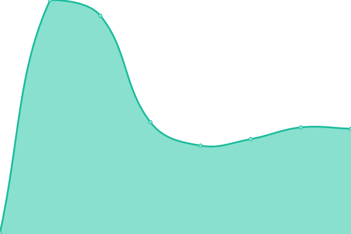
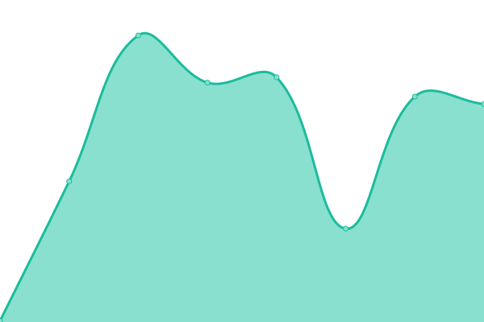

# [📈 Live Status](https://ameelan.github.io/adkbank-Upptime/): <!--live status--> **🟧 Partial outage**

This repository contains the open-source uptime monitor and status page for [Upptime](https://upptime.js.org), powered by [Upptime](https://github.com/upptime/upptime).

<!--start: status pages-->
<!-- This summary is generated by Upptime (https://github.com/upptime/upptime) -->
<!-- Do not edit this manually, your changes will be overwritten -->
<!-- prettier-ignore -->
| URL | Status | History | Response Time | Uptime |
| --- | ------ | ------- | ------------- | ------ |
|  [Google](https://www.google.com) | 🟩 Up | [google.yml](https://github.com/ameelan/adkbank-Upptime/commits/HEAD/history/google.yml) | 

 81ms
     
 | 

<a href="https://ameelan.github.io/adkbank-Upptime/history/google">100.00%</a>
    

|  [Wikipedia](https://en.wikipedia.org) | 🟩 Up | [wikipedia.yml](https://github.com/ameelan/adkbank-Upptime/commits/HEAD/history/wikipedia.yml) | 

 164ms
     
 | 

<a href="https://ameelan.github.io/adkbank-Upptime/history/wikipedia">100.00%</a>
    

|  [Adirondack Bank](https://www.adirondackbank.com/) | 🟩 Up | [adirondack-bank.yml](https://github.com/ameelan/adkbank-Upptime/commits/HEAD/history/adirondack-bank.yml) | 

 873ms
     
 | 

<a href="https://ameelan.github.io/adkbank-Upptime/history/adirondack-bank">100.00%</a>
    

|  [Test Broken Site](https://thissitedoesnotexist.koj.co) | 🟥 Down | [test-broken-site.yml](https://github.com/ameelan/adkbank-Upptime/commits/HEAD/history/test-broken-site.yml) | 

 0ms
     
 | 

<a href="https://ameelan.github.io/adkbank-Upptime/history/test-broken-site">100.00%</a>
    

|  [External Interface](209.217.199.214) | 🟥 Down | [external-interface.yml](https://github.com/ameelan/adkbank-Upptime/commits/HEAD/history/external-interface.yml) | 

 0ms
     
 | 

<a href="https://ameelan.github.io/adkbank-Upptime/history/external-interface">0.00%</a>
    

<!--end: status pages-->

[**Visit our status website →**](https://ameelan.github.io/adkbank-Upptime/)

## 📄 License

- Powered by: [Upptime](https://github.com/upptime/upptime)
- Code: [MIT](./LICENSE) © [Upptime](https://upptime.js.org)
- Data in the `./history` directory: [Open Database License](https://opendatacommons.org/licenses/odbl/1-0/)
